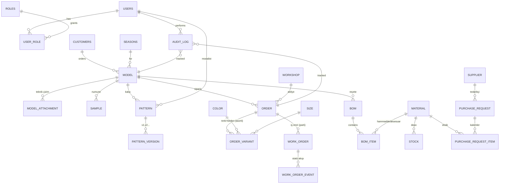

# 01 — ER Diyagramı ve Veri Modeli

Aşağıdaki şema tekstil MES/MRP sisteminin çekirdek ilişkilerini açıklar. Mermaid ER sözdizimi kullanılmıştır; GitHub ve VS Code (Mermaid eklentisi) ile render edilir.

---

## 1. Genel Diyagram (Mermaid ER)

---

## 2. Tablolar

### 2.1 Kimlik & Yetki

| Tablo | Temel Alanlar | Not |
|---|---|---|
| `users` | `id, email, full_name, is_active, created_at` | Supabase auth ile eşlenir |
| `roles` | `id, code (super_admin/tasarim/modalist/planlama/satinalma/uretim), name` | Sabit enum + tablo |
| `user_role` | `user_id, role_id` | M:N, bir kullanıcının birden fazla rolü olabilir |
| `audit_log` | `id, user_id, entity, entity_id, action (create/update/delete/transition), before_json, after_json, ts` | Her mutasyonda zorunlu |

### 2.2 Referans Verileri

| Tablo | Alanlar |
|---|---|
| `customers` | `id, code, name, contact` |
| `seasons` | `id, code (SS26, AW26), starts_at, ends_at` |
| `colors` | `id, code (PTN-RED-01), name, hex` |
| `sizes` | `id, code (S/M/L/36/38), order_index` |
| `workshops` | `id, code, name, daily_capacity_pcs` |
| `suppliers` | `id, code, name, contact` |

### 2.3 Tasarım / Model

| Tablo | Alanlar | Durum alanı |
|---|---|---|
| `model` | `id, code, name, customer_id, season_id, category, designer_id, due_date, status, created_at` | `status ∈ {TASLAK, NUMUNE_HAZIRLANIYOR, REVIZE, ONAYLANDI, IPTAL}` |
| `model_attachment` | `id, model_id, type (teknik_cizim/foto), file_url, uploaded_by, ts` | Supabase Storage URL |
| `sample` | `id, model_id, fabric_note, accessory_note, quality_note, critical_notes, status` | Numune kartı |

### 2.4 Kalıp (Modalist)

| Tablo | Alanlar |
|---|---|
| `pattern` | `id, model_id, assigned_to (user_id), started_at, closed_at, total_revisions` |
| `pattern_version` | `id, pattern_id, version_no, file_url, note, created_by, created_at` |

### 2.5 Planlama / Sipariş / İş Emri

| Tablo | Alanlar |
|---|---|
| `order` | `id, code, model_id, workshop_id, total_qty, due_date, status, created_by` |
| `order_variant` | `id, order_id, color_id, size_id, qty` (asorti matrisi) |
| `work_order` | `id, code (barkod), order_id, parent_work_order_id (parti bölme), qty, status, started_at, finished_at` |
| `work_order_event` | `id, work_order_id, from_status, to_status, reason, user_id, ts` |
| `workshop_capacity_day` | `id, workshop_id, day, booked_pcs` (çakışma uyarısı için agregasyon) |

> `order.status` ve `work_order.status` için ayrı state machine; detay `docs/02-STATE-MACHINE.md`.

### 2.6 Reçete (BOM) & Stok & Satın Alma

| Tablo | Alanlar |
|---|---|
| `bom` | `id, model_id, version, is_active, created_by` |
| `bom_item` | `id, bom_id, material_id, qty_per_unit, uom, waste_pct` |
| `material` | `id, code, name, type (kumas/aksesuar/iplik), uom, supplier_default_id` |
| `stock` | `id, material_id, warehouse, qty_on_hand, qty_reserved, updated_at` |
| `purchase_request` | `id, code, order_id, supplier_id, status (TASLAK/ONAY_BEKLIYOR/ONAYLI/TESLIM_ALINDI/IPTAL), created_by, due_date` |
| `purchase_request_item` | `id, purchase_request_id, material_id, qty, unit_price, note` |

### 2.7 Entegrasyon (Mikro ERP)

| Tablo | Alanlar |
|---|---|
| `sync_mapping` | `id, entity, local_id, mikro_id, last_pulled_at, last_pushed_at, hash` |
| `sync_queue` | `id, direction (IN/OUT), entity, payload_json, status, attempts, error, ts` |

> Dummy moddaki seed, canlıya geçerken `sync_mapping` tablosunu `mikro_id` ile doldurur; çift taraflı sync `packages/erp-mikro` adaptörü üzerinden yürür.

---

## 3. Kritik İş Kuralları (DB Seviyesinde)

1. **"Üretimi Başlat" engeli** — `work_order.status` `HAZIR → URETIMDE` geçişinde tetikleyici (trigger/check):
   - İlgili `order`'ın aktif `bom`'u olmalı.
   - `bom_item.qty_per_unit * order.total_qty` ihtiyacı `stock.qty_on_hand - stock.qty_reserved` ile karşılanabiliyor **veya** tüm eksikleri karşılayan `purchase_request` kaydı `ONAYLI` statüsünde olmalı. Aksi halde geçiş reddedilir.
2. **Kapasite çakışması** — Yeni `order` insert/update'inde `workshop_capacity_day` toplamı `workshops.daily_capacity_pcs` değerini aşıyorsa UI uyarı gösterir; zorla kaydetmek için `super_admin` override alanı (`override_reason`) zorunlu.
3. **Asorti tutarlılığı** — `sum(order_variant.qty) = order.total_qty` (check constraint / deferred trigger).
4. **Versiyonlama** — `pattern_version.version_no` aynı `pattern_id` için `UNIQUE`. Yeni revize eklendiğinde `pattern.total_revisions` otomatik artar.
5. **Audit** — Tüm `model/order/work_order/bom/purchase_request` mutasyonları `audit_log`'a satır yazmadan commit olamaz (DB trigger).

---

## 4. RLS (Supabase) Taslak Politikaları

- `model`: `SELECT` herkese; `INSERT/UPDATE/DELETE` sadece `tasarim` veya `super_admin`.
- `pattern`, `pattern_version`: yazma sadece `modalist` veya `super_admin`.
- `order`, `work_order`: yazma sadece `planlama` veya `super_admin`.
- `bom*`, `purchase_request*`, `stock`: yazma sadece `satinalma` veya `super_admin`.
- `audit_log`: insert = system (service role); kullanıcıdan doğrudan yazmaya kapalı, `SELECT` tüm rollere açık.
- `users`, `user_role`: sadece `super_admin` (tek kişi — siz).

---

## 5. Index / Performans Notları

- `model(status, due_date)`, `order(status, due_date)`, `work_order(status)` dashboard filtreleri için.
- `stock(material_id)` UNIQUE+partial; `audit_log(entity, entity_id, ts DESC)` timeline için.
- `order_variant(order_id, color_id, size_id)` UNIQUE — asortide duplikasyonu engeller.
