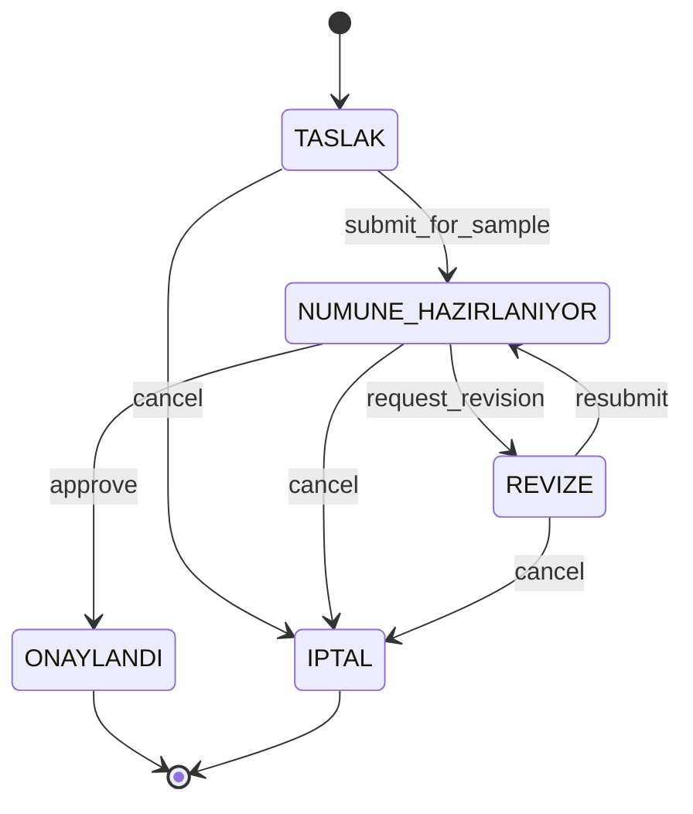
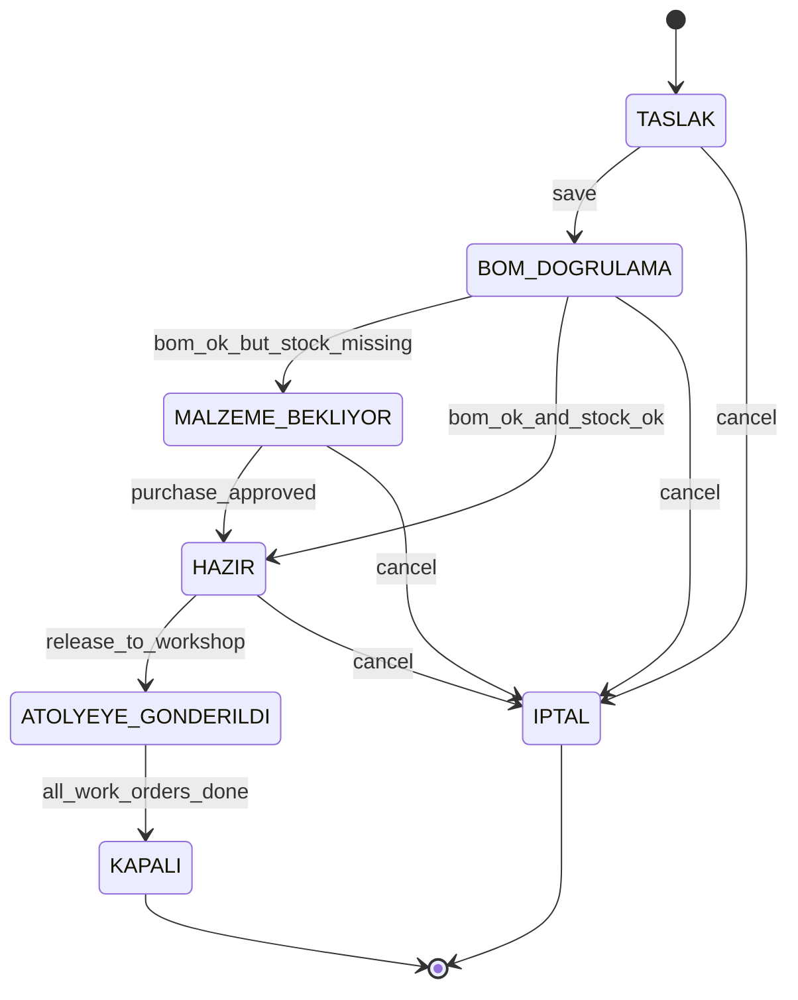
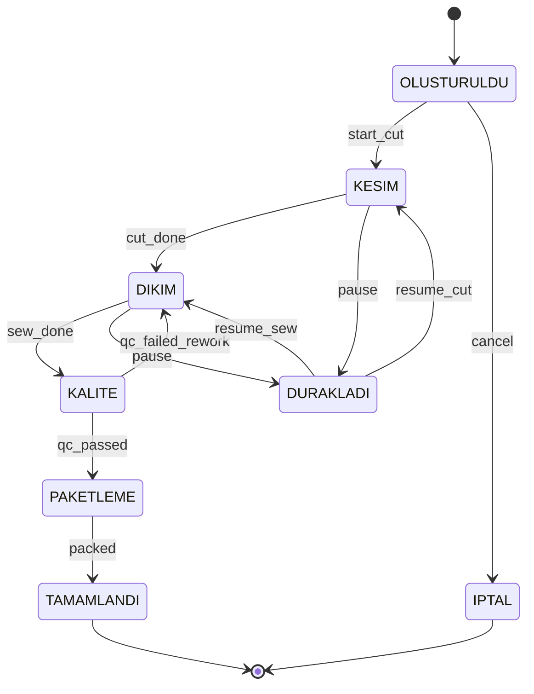

# 02 — State Machine: "Taslak → Atölye" Akışı

Bir ürünün fikir aşamasından (Model = Taslak) atölyeye iş emri olarak düşmesine kadar izlediği yolu tanımlar. Üç ayrı ama bağlı state machine vardır:

1. **Model SM** — Tasarım tarafı
2. **Order SM** — Planlama tarafı
3. **WorkOrder SM** — Atölye / üretim tarafı

---

## 1. Model State Machine (Tasarım)



### Geçiş Guard'ları

| Geçiş | Tetikleyen Rol | Zorunlu Koşullar |
|---|---|---|
| `submit_for_sample` | Tasarım | `model.name`, `customer_id`, `season_id`, `due_date`, en az 1 `model_attachment (teknik_cizim)` |
| `request_revision` | Modalist / Tasarım | `sample.critical_notes` doldurulmuş olmalı |
| `approve` | Tasarım + Modalist imzası (2-aşamalı) | Aktif `pattern_version` var; `sample.status = OK` |
| `cancel` | Tasarım / Super Admin | `reason` alanı zorunlu; ilgili aktif `order` yoksa |

---

## 2. Order State Machine (Planlama)

Model `ONAYLANDI` olduktan sonra Planlama ekibi sipariş açar.



### Guard Kuralları

| Geçiş | Koşul |
|---|---|
| `save` | `model.status = ONAYLANDI`, `workshop_id`, `due_date`, `total_qty > 0`, `sum(order_variant.qty) = total_qty` |
| `bom_ok_but_stock_missing` | Model'in aktif `bom`'u var **ama** bazı `bom_item` için `stock.qty_on_hand - qty_reserved < ihtiyac`. Sistem eksik kalemleri listeleyip **otomatik** `purchase_request` taslağı oluşturur. |
| `bom_ok_and_stock_ok` | Tüm kalemler karşılanıyor. `stock.qty_reserved` **atomik** arttırılır (rezervasyon). |
| `purchase_approved` | `purchase_request.status = ONAYLI` **ve** termin ≤ `order.due_date` |
| `release_to_workshop` | Kapasite kontrolü: seçilen gün için `workshop_capacity_day.booked_pcs + total_qty ≤ daily_capacity_pcs`. Çakışma varsa UI uyarı + super_admin override. Başarılıysa `work_order` kayıtları (parti bölme tercihine göre) oluşturulur. |
| `all_work_orders_done` | Tüm alt `work_order.status = TAMAMLANDI` |
| `cancel` | Sonraki durumda `ATOLYEYE_GONDERILDI` değilse serbest; değilse super_admin onayı gerekli. Rezervasyonlar geri alınır. |

### "Üretimi Başlat" Butonu UI Mantığı

```
canRelease = order.status === 'HAZIR'
          && workshopCapacityOk(order)
          && userHasRole(['planlama','super_admin'])
          && !hasBlockingAudit(order)
```
Buton aksi halde **pasif** kalır; tooltip nedeni gösterir (örn. "Kırmızı iplik için satın alma onayı bekleniyor").

---

## 3. WorkOrder State Machine (Atölye)



> Her geçiş `work_order_event` tablosuna yazılır. Barkod okutma = `transition` tetikleyicisi (Faz 5'te fiziksel cihaz).

---

## 4. Uçtan Uca Senaryo Örneği

> **Model:** "SS26-KADIN-GOMLEK-001", Müşteri: Acme, Kalıp atanan modalist: Ayşe.

| Adım | Aktör | Eylem | Sistem Tepkisi |
|---|---|---|---|
| 1 | Tasarım | Model kartı açar, teknik çizim yükler | `model.status = TASLAK`, audit_log kaydı |
| 2 | Tasarım | "Numuneye Gönder" | `TASLAK → NUMUNE_HAZIRLANIYOR`. Modaliste atama bildirimi. |
| 3 | Modalist | Kalıp v1 yükler, kritik not ekler | `pattern_version(v=1)` oluşur; `pattern.total_revisions = 1` |
| 4 | Tasarım | Revize ister | `NUMUNE_HAZIRLANIYOR → REVIZE` |
| 5 | Modalist | v2 yükler | `REVIZE → NUMUNE_HAZIRLANIYOR`, version_no=2 |
| 6 | Tasarım + Modalist | Onay | `→ ONAYLANDI`. Planlama bildirimi. |
| 7 | Planlama | Sipariş açar (3 renk × 4 beden, 1200 adet, termin 30 gün) | `order.status = TASLAK → BOM_DOGRULAMA` (`save`) |
| 8 | Sistem | BOM kontrolü | Kırmızı iplik eksik. `order → MALZEME_BEKLIYOR`, otomatik `purchase_request(TASLAK)` kalemi hazırlar |
| 9 | Satın Alma | Talebi `ONAYLI` yapar | `order → HAZIR`, `stock.qty_reserved` güncellenir |
| 10 | Planlama | "Üretimi Başlat" | Kapasite OK → `order → ATOLYEYE_GONDERILDI`. 3 adet `work_order` (parti bölünmüş) üretilir; barkodlar basılır. |
| 11 | Atölye | İlk partide kesim başlar | `work_order(OLUSTURULDU → KESIM)` — barkod okutma |
| 12 | Atölye | Tüm partiler `TAMAMLANDI` | `order → KAPALI`, dashboard KPI güncellenir |

---

## 5. Uygulama Kodu İskeleti (TypeScript)

Faz 1'de `packages/contracts/state-machines/order.ts` içine yerleştirilecek referans:

```ts
// packages/contracts/state-machines/order.ts
export type OrderStatus =
  | 'TASLAK' | 'BOM_DOGRULAMA' | 'MALZEME_BEKLIYOR'
  | 'HAZIR'  | 'ATOLYEYE_GONDERILDI' | 'KAPALI' | 'IPTAL';

export type OrderEvent =
  | 'save' | 'bom_ok_but_stock_missing' | 'bom_ok_and_stock_ok'
  | 'purchase_approved' | 'release_to_workshop'
  | 'all_work_orders_done' | 'cancel';

const transitions: Record<OrderStatus, Partial<Record<OrderEvent, OrderStatus>>> = {
  TASLAK:              { save: 'BOM_DOGRULAMA', cancel: 'IPTAL' },
  BOM_DOGRULAMA:       { bom_ok_but_stock_missing: 'MALZEME_BEKLIYOR',
                         bom_ok_and_stock_ok: 'HAZIR',
                         cancel: 'IPTAL' },
  MALZEME_BEKLIYOR:    { purchase_approved: 'HAZIR', cancel: 'IPTAL' },
  HAZIR:               { release_to_workshop: 'ATOLYEYE_GONDERILDI',
                         cancel: 'IPTAL' },
  ATOLYEYE_GONDERILDI: { all_work_orders_done: 'KAPALI' },
  KAPALI:              {},
  IPTAL:               {},
};

export function next(status: OrderStatus, event: OrderEvent): OrderStatus {
  const to = transitions[status]?.[event];
  if (!to) throw new Error(`Illegal transition ${status} --${event}-->`);
  return to;
}

// Guard örneği
export interface OrderContext {
  hasActiveBom: boolean;
  stockCoversDemand: boolean;
  activePurchaseApproved: boolean;
  workshopCapacityOk: boolean;
  userRoles: string[];
}

export function canFire(
  status: OrderStatus, event: OrderEvent, ctx: OrderContext
): { ok: boolean; reason?: string } {
  const role = ctx.userRoles;
  const needs = (r: string[]) => r.some(x => role.includes(x));

  switch (event) {
    case 'save':
      return needs(['planlama','super_admin'])
        ? { ok: true }
        : { ok: false, reason: 'Yetki yok (planlama)' };
    case 'bom_ok_and_stock_ok':
      return ctx.hasActiveBom && ctx.stockCoversDemand
        ? { ok: true }
        : { ok: false, reason: 'BOM veya stok yetersiz' };
    case 'purchase_approved':
      return ctx.activePurchaseApproved
        ? { ok: true }
        : { ok: false, reason: 'Onaylı satın alma yok' };
    case 'release_to_workshop':
      return ctx.workshopCapacityOk && needs(['planlama','super_admin'])
        ? { ok: true }
        : { ok: false, reason: 'Kapasite dolu veya yetki yok' };
    default:
      return { ok: true };
  }
}
```

---

## 6. Hata Senaryoları ve Davranış

| Durum | Davranış |
|---|---|
| Atölye kapasitesi aşıldı | `release_to_workshop` bloklanır. UI "Çakışma" rozetiyle uyarır. Super admin `override_reason` ile geçebilir (audit'e yazılır). |
| Stok rezervi sonradan bozuldu (başka sipariş aldı) | `HAZIR` sipariş `MALZEME_BEKLIYOR`'a otomatik geri düşer; Slack/e-posta bildirimi. |
| Kalıp revizesi `ONAYLANDI`dan sonra gelirse | Yeni `model.status = REVIZE` değil; bunun yerine aktif `order`'ları pause'lar ve yeni `bom` versiyonunu zorunlu kılar. |
| Mikro ERP'den gelen sync ters çakışma | `sync_queue` üzerinde `CONFLICT` işareti, manuel çözüm UI'ı super admin'e gösterilir. |
